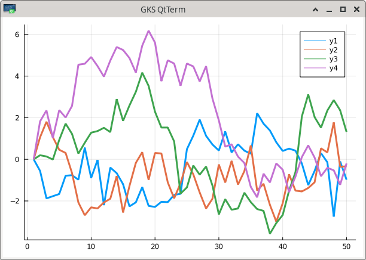
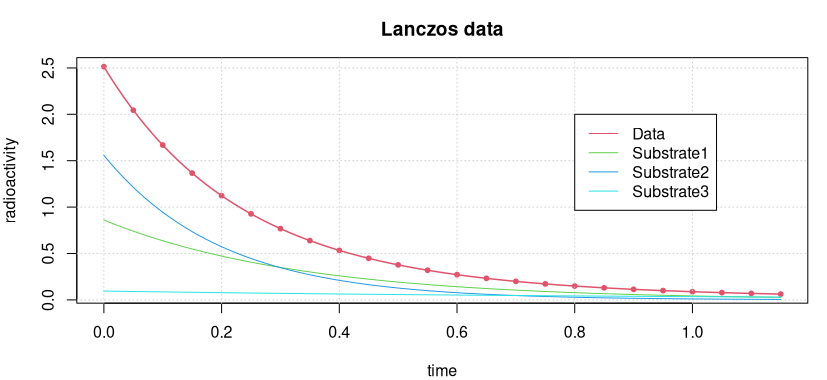
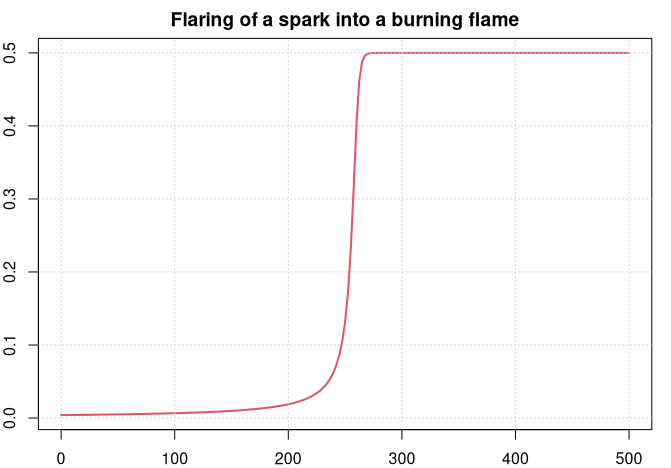

# JuliaCall: Integrating R and Julia

Author: Hans W. Borchers, *Duale Hochschule BW, Mannheim*  
Date: *January 24, 2021*

----

### Contents

  * Introduction
  * Using JuliaCall
  * Computing with JuliaCall
  * Loading datasets
  * Plotting functionality
  * Application examples
  * Differential equations
  * Optimization and JuMP
  * Appendix

----

## Introduction

### Installing Julia

We assume the user has installed a newer version of R, such as R >= 4.0.0 (April 2020), and knows how to install R packages. Besides that, the user shall install Julia by himself. The latest stable version is Julia 1.5.3 (as of November 2020) and can be downloaded from the Julia language home page [julialang.org](https://julialang.org/) for the major operating systems Windows, macOS, and Linux.

Some Julia packages will be needed. Though the `julia_setup` routine tries to install the necessary packages, it might be preferable to download and install some packages directly from Julia, and before Julia is called the first time from R.

    > julia
       _       _ _(_)_     |  Documentation: https://docs.julialang.org
      (_)     | (_) (_)    |
       _ _   _| |_  __ _   |  Type "?" for help, "]?" for Pkg help.
      | | | | | | |/ _` |  |
      | | |_| | | | (_| |  |  Version 1.5.3 (2020-11-09)
     _/ |\__'_|_|_|\__'_|  |
    |__/                   |
    
    julia>

After loading the *Pkg* package with `using Pkg`, the command `Pkg.add()` will download and install Julia packages (in the `.julia` subdirectory of your home directory) once, and `using <pkg>` will load these into the active session, just like `library()` in R. For instance, *RCall* will enable Julia to call R routines or get access to R objects.

To be used, *Pkg* itself needs to be loaded with `using Pkg`, and then type `Pkg.add("RCall")`. It is easier to apply the ']' operator that will change the console mode to accept package commands. This mode will be left by pressing the `<del>` key.

    julia> ]
    (v1.5) pkg> add RCall
    ## Updating ...
    (v1.5) pkg> <del>

    julia> using RCall
    julia> ...

There is also a help mode that can be raised by typing the question mark `?`.


### Installing JuliaCall

*JuliaCall* is an R package, available on CRAN, by Changcheng Li. We would recommend to always install the newest version of *JuliaCall* from Github. The *devtools* R package provides the `install_github()` routine to do that for us if we know the name of the Github repository.

```r
# devtools::install_github("Non-Contradiction/JuliaCall")
# JuliaCall | Version 0.17.2.9000 (2021-01-17) | MIT + file LICENSE

library(JuliaCall)
julia_setup()

## Julia version 1.5.3 at location /usr/bin will be used.
## Loading setup script for JuliaCall...
## Finish loading setup script for JuliaCall.
```

This only works if the `julia` command is defined in your path. The path, e.g., to a different Julia version can be added to `julia_setup()`
as an option or argument. The following code starts a JuliaPro installation from **JuliaComputing** instead of Julia from **julialang.org**.

```r
options(JULIA_HOME = "<path-to-juliapro>/julia/bin")
julia_setup()

# or
# julia_setup(JULIA_HOME = "<path-to-juliapro>/julia/bin")
```

All commands in *JuliaCall* start with a `julia_` prefix. It is also possible to call these commands with a `jl$` prefix by assigning the setup command to the variable `jl` (or any other valid name) with `jl <- julia_setup()` -- if the user prefers that kind of style.

----

## Using JuliaCall

### Basic JuliaCall Commands

To check whether Julia is working from R, type in a simple command such as calling the Julia square root funtion on 2.0 by applying `julia_call()`.

```r
julia_call("sqrt", 2.0)
## [1] 1.414214
```

Here the Julia square root function `sqrt` is applied to the number `2.0`. The argument is taken from R and converted to a Julia object, a number in this case, before applying the square root. The value is returned to R as an R object and can be assigned to a variable. In this variant, no values or variables are generated in Julia.

To execute a Julia command use `julia_command`. It can run a series of Julia commands, separated by semicolons and will, or will not, print the last Julia output, depending on whether a semicolon is appended to the last command, or not. 

```r
julia_command("a = sqrt(2.0)")
## [1] 1.4142135623730951

julia_command("a = sqrt(2.0);")   # no output printed
```

The Julia variable `a` will be generated and the Julia output of the last command will be printed on the console. To completely suppress the output, append a semicolon. `julia_command` does *not* return a value to R -- more to the point, `NULL` is returned invisibly.

To get the value of a Julia variable back to R, use the `julia_eval` command. It will convert the value or Julia object to an R object and print it or assign it to an R variable.

```r
julia_eval("a = sqrt(2.0)")
## [1] 1.414214
```

You can apply `julia_eval` on a sequence of Julia expression, separating commands with semicolons `;`. The value of the last command will be returned, whether there is a semicolon at the end or not.

(To explain this subtle difference in other words: `julia_command` will print the Julia output and return nothing, `julia_eval` will return and print the result as an R object.)

Finally, there is `julia_assign`, another useful operator. It takes an R object like a number, vector, matrix, etc., turns it into a Julia object and assigns a variable name to it. This variable can then be used in subsequent Julia commands.

```r
julia_assign("gamma", 0.57721566490153286)
julia_command("bitstring(gamma)")
## "0011111111100010011110001000110011111100011011111011011000011001"
```

In Julia, this will assign to the variable name `gamma` the value of the Euler-Mascheroni or Gamma constant. Function `bitstring` prints the "literal bit representation" of `gamma` as a number in Julia.

A note about variable names: It is convenient to give an assigned variable the same name in R as in Julia. There is no danger that these two variables will interfere as they exist in different environments. We will largely follow this policy here.


### The Julia Console

It is possible to start the Julia REPL within R with the `julia_console()` command. The variable `a` is still available.

```r
julia_console()
## It seems that you are not in the terminal.
## A simple julia console will be started.
## Type exit and then enter to exit.

julia> a^2
2.0000000000000004

julia> e = exp(1);
julia> <cntrl-D>
Exiting Julia console.
```

Exit with `<cntrl-D>` returns control to the R command. Note again that in Julia the output of a command such as `e = exp(1)` is suppressed by appending a semicolon (as in MATLAB or Octave). `e` still exists and can be used in R.

```r
julia_exists("e")
[1] TRUE

e <- julia_eval("e")
e
## [1] 2.718282
```

The `julia_console` functionality is especially useful when you have some knowledge about programming in Julia. Writing Julia code is much easier in this environment, and when exiting the results are still available in R.


### Julia Packages

The user can start Julia and install and load packages. After restarting R and the *JuliaCall* library, these packages are available. It is also possible to install and load Julia libraries with *JuliaCall* functions.

```r
# julia_install_package("Optim")            # julia> Pkg.add("Optim")
# julia_install_package_if_needed("Optim")
julia_installed_package("Optim")            # Optim version number
## [1] "1.2.0"
julia_library("Optim")                      # julia> using Optim
```

The `julia_library()` command will load an installed package, that is, in Julia the command `using Optim` will be initiated. (Note that all Julia package names start with a capital letter.)

Be prepared that this may take its time as loading libraries may be slow in Julia, especially if the  package is newly installed and has to be precompiled (JIT compilation).

Some packages worth looking at are:

  - **Plots** for visualization and data analysis;
  - **DifferentialEquations** with high-performance solvers for differential equations;
  - **ForwardDiff** providing Automatic Differentiation (AD) in Julia;
  - **JuMP**, a modeling language for mathematical optimization;
  - **Image**, an image processing library;
  - **GLM** for generalized and linear models; or
  - **DataFrames** for working with tabular data.

The **GR** package provides a framework, based on the "Grammar of Graphics", for visualisation applications. Several packages exist for deep learning (**Mocha**, **Flux**, **Knet**, **MXNet**, **TensorFlow**, etc.). See the [Julia Observer](https://juliaobserver.com/packages/) for some of the highest-ranked packages, listed by categories.


### Getting Help

To get help for a Julia function use `julia_help()`. The quality of help in Julia is quite diverse, some functions have virtually no documentation (yet), others are documented quite well. The result of `julia_help("sqrt")` is

```
sqrt(x)

Return $\sqrt{x}$. Throws [`DomainError`](@ref) for negative [`Real`](@ref) arguments.
Use complex negative arguments instead.
The prefix operator `\sqrt` is equivalent to `sqrt`.
...
```

This explains that `sqrt(-1)` will result in an error in Julia (`NA` in R). The imaginary unit in Julia is `im` so the correct call will be 

```r
julia_eval("sqrt(-1+0im)")
## [1] 0+1i
```

The Julia complex number `1im` has been converted to the R representation `1i`. (In Julia an expression "a number times a variable" `5*x` can also be written as shorthand `5x`.) 

In general, reading help for Julia functions through the `julia_help()` interface is not recommended as some of the formatting is lost and the help is difficult to read. Instead, read the newest documentation on [docs.julialang.org](https://docs.julialang.org/en/), or open a terminal where Julia runs and look at the help page there.

----

## Computing With JuliaCall

### Numbers, Vectors, Matrices

We have already seen simple commands for interacting between R and Julia. `julia_eval()` and `julia_command()` evaluate a string containing a correct Julia expression and return the result to R. `julia_call()` accepts a Julia function name as string plus R variables and returns the result when applying the function in Julia. And `julia_assign` converts an R object and makes it accessible to Julia functions.

```r
set.seed(1001)
A <- matrix(runif(9), 3, 3)

julia_assign("a", A)    # assign a Julia name to an R variable
julia_exists("a")       # variable 'a' exists in Julia
## TRUE

julia_call("typeof", a) # what is the type of object 'a'?
## Julia Object of type DataType.
## Float64

julia_eval("det(a)")
## [1] 0.01609354
```

Numbers in R like `1` or `1.0` are floating point and will be converted with `julia_assign()` to floating point numbers in Julia. If a Julia function requires natural numbers as arguments, think of defining them in R with the 'L' notation.

For instance, generate 10 random numbers with

```r
julia_call("rand", 10L)
## [1] 0.8045609 ...
```

while `julia_call("rand", 10)` will throw an error -- with quite a long error message. Again, `julia_eval("rand(10)")` would be okay, as in Julia `10` is an integer and not equal to the floating-point number `10.0`.

Vectors and matrices in R are transformed to vectors and matrices of the same length and dimension in Julia. We will solve a system of linear equations in Julia, taking vector and matrix from R. For simplicity, take the same variable names in R and Julia.

```r
A <- matrix(c(1.5,2,-4, 2,-1,-3, -4,-3,5), 3, 3, byrow = TRUE)
b <- c(1, 2, 3)
julia_assign("A", A)            # same var names in R and Julia
julia_assign("b", b)

julia_command("x = A\\b;")      # solve the system with `\`
julia_eval("x")
## [1] -1.739130 -1.108696 -1.456522
```

We apply the `\` operator in Julia that solves the linear system, the same as in MATLAB. Backslash being the escape character, we have to double it in a string.


### Julia Functions

Of course, all the common mathematical functions are available in Julia, like trigonometric or exponential functions or logarithms, etc.

```r
julia_eval("sin(pi/2)")
## [1] 1
```

We have to be careful about applying Julia functions to vectors (or matrices, etc.) because these functions are *not* vectorized by default. Instead, we can use the *dot* notation of Julia. If `f` is a function, then for a vector `x` the expression `f.(x)` will *broacast* the function over the vector, that is apply it to each element of the vector and generate a vector of results.

```r
julia_command("x = [0, pi/4, pi/2, pi];")
julia_eval("sin(x)")
## Error: Error happens in Julia.
## MethodError: no method matching sin(::Array{Float64,1})

julia_eval("sin.(x)")
[1] 0.000000e+00 7.071068e-01 1.000000e+00 1.224647e-16
```

Here we use the Julia notation for explicitly generating a vector with `[...]`, a MATLAB-like notation, corresponding to R's `c(...)`. By the way, applying `sin.` with `julia_call` to an R vector will act in a vectorized way.

```r
julia_call("sin.", c(0, pi/4, pi/2, pi))
[1] 0.000000e+00 7.071068e-01 1.000000e+00 1.224647e-16
```

The `julia_assign()` lets you also associate Julia names with R functions, that is functions in Base R or packages, or user-defined functions. As an example, we will define the Runge function in R and integrate that function with a Julia integration routine.

```r
fRunge = function(x) 1 / (1 + (5*x)^2)
integrate(fRunge, -1, 1)
## 0.5493603 with absolute error < 2.1e-06
```

To make this function callable in Julia we have to tell Julia where to find and how to call the R function. Let us give it the same variable name `fRunge`, that is

```r
julia_assign("fRunge", fRunge)
julia_call("fRunge", c(-1, -0-5, 0, 0.5, 1))
## [1] 0.03846154 0.13793103 1.00000000 0.13793103 0.03846154

julia_eval("fRunge([-1.0, -0.5, 0, 0.5, 1.0])")
## [1] 0.03846154 0.13793103 1.00000000 0.13793103 0.03846154
```

Surprisingly, as a Julia function `jlRunge` is vectorized, we can apply it to vectors without involving the 'dot' notation. The reason is that behind the scenes we are calling an R function that *is* vectorized. (But applying the 'dot' notation would also deliver the correct result.)

We want to integrate this function applying the Gauss-Kronrod integration routine in Julia. For this the *QuadGK* package is needed (and needs to be installed).

```r
# julia_install_package("QuadGK")
julia_library("QuadGK")
julia_command("I, err = quadgk(jlRunge, -1, 1);")
julia_eval("[I, err]")
## [1] 5.493603e-01 1.058539e-09
```

(Besides, `I, err = ...` is an example of "multiple return values", a concept taken from Python.)

We could have defined the Runge function in Julia directly. As a function it is a one-liner, a shorthand notation for such cases is available in Julia by simply formulating it in its mathematical form `f(x) = ...`.

```r
julia_command("runge(x) = 1 / (1 + (5*x)^2)")
## runge (generic function with 1 method)
```

One note of caution. Our new function `runge` is *not* vectorized: Applying it to a vector `[-1.0, -0.5, 0, 0.5, 1.0]` will raise a `MethodError`.

Now we can integrate it as a pure Julia function (Integration routines in Julia do not request the integrand to be vectorized.)

```r
julia_command("I, err = quadgk(runge, -1, 1)")
## (0.5493603067780064, 1.0585390480821744e-9)
```

Functions without an associated variable names, so-called 'anonymous functions', are defined with the `->` operator, similar to one-liner functions. Instead of defining `runge`, integrate it as an anonymous function.

```r
julia_command("I, err = quadgk(x -> 1/(1 + (5*x)^2), -1, 1)")
## (0.5493603067780064, 1.0585390480821744e-9)
```

Function definition in Julia can be quite elaborated and has many options (like keywords, type definitions for function input and output, etc.). The two possible syntaxes described in this section are often sufficient for getting computational results back in R.


### More Function Magic

Imagine there is a file `miscellaneous.jl` in the working directory that contains the following definition of a function in Julia. This `agm` function calculates the algebraic-geometric mean of two numbers `a` and `b`.

```
function agm(a, b; tol = 1.0e-15)
    a0 = a; b0 = b
    while abs(b0-a0) >= tol
        a0, b0 = (a0 + b0)/2.0, sqrt(a0 * b0)
    end
    return (a0 + b0) / 2.0
end
```

(The argument `tol` after the semicolon is actually a *keyword* argument and will be treated slightly different. The arguments before the semicolon, whether they have default values or not, have to be provided in the sequence they are seen in the function definition.)

With `julia_source()` we can source this file in to Julia. Julia will JIT-compile it and make it available for the user. 

```r
julia_source("miscellaneous.jl")
julia_exists("agm")
[1] TRUE
```

For instance, `1/agm(1, sqrt(2.0)` is the so-called *Gauss constant* and has an important relation to elliptic integrals.

```r
G = 1 / julia_call("agm", 1.0, sqrt(2.0))
print(G, digits=16)
## [1] 0.8346268416740731

# Or
julia_command("1.0 / agm(1.0, sqrt(2.0); tol = 1e-12)")
0.8346268416740731
```

(The keyword argument `tol` cannot be provided with `julia_call` as the semicolon would stop the R command.)

The `agm` function, calculated through an iteration, is not vectorized, that is the expression `agm(1, [0.5, 1.0, 1.5]` will not work out. Julia will tell us "no method matching agm(::Int64, ::Array{Float64,1})". Instead, we can use the *dot* notation of Julia.

```
julia_command("agm.(1, [0.5, 1.0, 1.5])")
## 3-element Array{Float64,1}:
##  0.7283955155234534
##  1.0     
##  1.237340218118152
```

Julia provides the ability to do calculations with multi-precision numbers, based on the MPFR software program, which is also used by R's *Rmpfr* and *gmp* packages. Our `agm` function accepts these `Bigfloat` numbers as it only employs arithmetical operations.

```r
julia_command("b1 = BigFloat(1.0); b2 = BigFloat(2.0);")
julia_command("G = 1 / agm(b1, sqrt(b2), tol = 1e-50)")
## 0.8346268416740731862814297327990468089939
##    930134903470024498273701036819927095195
```

About 50 digits of this expression shall be correct. The question remains how these digits can be saved for further treatment in R. Assigning it to an R variable will loose those digits when converting to 64-bit floats.

----

## Loading datasets

### Retrieve R datasets

Many datasets known from R Base and packages are available through the [RDatasets](https://github.com/JuliaStats/RDatasets.jl) package in Julia. Most of the standard datasets in Base R as well as those included with popular R packages are available.

`RDatasets.packages()` will show a table of R packages considered, and `RDatasets.datasets()` a table of the 700+ datasets included. The prefix `RDatasets` is needed as these functions are not exported (but `dataset` is).
Pass in `RDatasets.datasets("HSAUR")` to receive a targeted table for the *HSAUR* package (first edition).

```r
julia_command("using DataFrames, RDatasets")  # julia_library(...)

julia_command('planets = dataset("HSAUR", "planets");')
julia_command('typeof(planets)')
## DataFrame

julia_command('head(planets)')
```

    6×3 DataFrame
    │ Row │ Mass    │ Period  │ Eccen   │
    │     │ Float64 │ Float64 │ Float64 │
    ├─────┼─────────┼─────────┼─────────┤
    │ 1   │ 0.12    │ 4.95    │ 0.0     │
    │ 2   │ 0.197   │ 3.971   │ 0.0     │
    │ 3   │ 0.21    │ 44.28   │ 0.34    │
    │ 4   │ 0.22    │ 75.8    │ 0.28    │
    │ 5   │ 0.23    │ 6.403   │ 0.08    │
    │ 6   │ 0.25    │ 3.024   │ 0.02    │


### CVS Files

To read CSV files into Julia we utilize the [CSV]() package.

```r
julia_command('using CSV, DataFrames')
julia_command('glass_csv = CSV.File("glass.csv");')
julia_command('typeof(glass_csv)')
## CSV.File{false}
```

The return type/class of `CSV.File()` is *not* a data frame, so we still have to convert it with the help of the [DataFrames]() package. Here we also introduce the *pipe*-operator of Julia.

```r
julia_command('glass_df = glass_csv |> DataFrame;')
julia_command('typeof(glass_df)')
## DataFrame
```


### Transfering dataframes

To transfer the 'glass' data to R we simple use the `julia_eval()` function.

```r
glass <- julia_eval("glass_df")
class(glass)
## "data.frame"

head(glass)
```

          row      RI    Na   Mg   Al    Si    K   Ca Ba   Fe Type
    1   1 1.52101 13.64 4.49 1.10 71.78 0.06 8.75  0 0.00    1
    2   2 1.51761 13.89 3.60 1.36 72.73 0.48 7.83  0 0.00    1
    3   3 1.51618 13.53 3.55 1.54 72.99 0.39 7.78  0 0.00    1
    4   4 1.51766 13.21 3.69 1.29 72.61 0.57 8.22  0 0.00    1
    5   5 1.51742 13.27 3.62 1.24 73.08 0.55 8.07  0 0.00    1
    6   6 1.51596 12.79 3.61 1.62 72.97 0.64 8.07  0 0.26    1

And vice versa, to make an R dataframe be known in Julia we would use 
`julia_assign("glass", glass)`. The `glass` variable in Julia then points to the data structure in R and can be handled as a `DataFrame` in Julia.

----

## Plotting Functionality

### Using the 'Plots' package

At the moment the behavior of Julia plotting routines through JuliaCall appears to be slightly different for the operating systems Windows, macOs, and Linux. I will shortly describe the Linux case. All this may not work for you if you are working with RStudio.

We will utilize the Julia [Plots](https://docs.juliaplots.org/latest/) package that integrates several plotting packages under one common API. We have to prepare:

```r
julia_command('ENV["GKSwstype"] = "gksqt"')
# plotsViewer()

julia_command("using Plots")
julia_command("gr()")         # or: gr(), plotly(), pyplot()
```

The `plotsViewer()` function should tell Julia to do two things for plots: the first is to save the image to some temporary place, and the second is to use R's or the operating system's browser to view the image. [Unfortunately, at the moment it is not working correctly on macOS.]

Note that the `julia_command('ENV["GKSwstype"]="gksqt";')` activates the GKS QT backend, and may or may not be necessary. If it is necessary, it needs to be executed before loading the plotting library to take effect.

```r
julia_command("Plots.plot(Plots.fakedata(50,4),w=3)")
# julia_command("gui()")
```



This uses the [GR](https://gr-framework.org/) framework that is the default *backend* and can be reinstantiated with `gr()`. If no window pops up or is rendered in RStudio's viewer panel, the command `gui()` should open an external plotting window.

The `plotly()` backend (see [Plotly](https://plotly.com/julia/)) may be easier to handle as it will open the plot in a browser of the operating system. Also `pyplot()` (see [PyPlot](https://github.com/JuliaPy/PyPlot.jl)) works quite well and renders in the viewer pane.
(See [Backends](https://docs.juliaplots.org/latest/backends/) for more 'backends'.)


### The 'Grammar of Graphics'

The package [Gadfly](http://gadflyjl.org/stable/) implements 'Grammar of Graphics' plotting functionality for Julia, quite similar to what *ggplot2* does for R.


### A Hybrid Approach

A sometimes more convenient way to plot functions or display images is to leave the heavy computation to Julia, retrieve the calculated values or coordinates to R, and do the plotting with R's plot functions. This may be especially appropriate if the figure shall be rendered in the plots pane of RStudio.

----

## Applications

### Linear Algebra

The *Moler matrix* is a symmetric matrix with exactly one very small eigenvalue. It is well suited for testing eigenvalue computations. In R a Moler matrix of size `nxn` can be generated through the *pracma* function `moler(n)`. Let's try to find out its small eigenvalue for dimension `n=100`.

```r
M <- pracma::moler(100)
M
##        [,1] [,2] [,3] [,4] [,5] [,6] [,7] [,8] [,9] [,10] ...
##   [1,]    1   -1   -1   -1   -1   -1   -1   -1   -1    -1 ...
##   [2,]   -1    2    0    0    0    0    0    0    0     0 ...
##   [3,]   -1    0    3    1    1    1    1    1    1     1 ...
##  ...
## [100,]   -1    0    1    2    3    4    5    6    7     8 ...

( e <- eigen(M)$values )
##  [1] 3.934277e+03 4.390118e+02 1.593905e+02 8.235182e+01  ...
## [97] 2.250558e+00 2.250248e+00 2.250062e+00 5.473381e-14
```

This last small eigenvalue is certainly incorrect -- but how much? Knowing that the determinant of a Moler matrix is 1 and assuming all the bigger eigenvalues are calculated correctly, an estimate for the smallest eigenvalue would be

```r
print(1.0/prod(e[1:99]), digits=16)
## [1] 5.600713750073471e-60
```

Changing `M` with *Rmpfr* to a high-precision object does not help, as `eigen()` does not recognize multiple precision numbers. But also Julia's `eigvals()` function does not work with "big" numbers, it returns the same eigenvalues as above.

Instead, we make use of the function with the same name from the *GenericLinearAlgebra* Julia package. First we assign the Julia variable `M` to our matrix `M` in R, then convert it to a matrix of "big" numbers and apply the eigenvalue function.

```r
    julia_command("using GenericLinearAlgebra;")
    
    julia_assign("M", M)
    julia_command("e = eigvals(Hermitian(big.(M)));")

    julia_command("println(e[1])")
    ## 5.60071375007503416508581022876389348658607158043730...e-60
```

This is really a small eigenvalue, especially compared to the other eigenvalues of this matrix. We can see that the estimated eigenvalue above (knowing the determinant of the Moler matrix) was exact up to 12 digits.


### Nonlinear Regression

The following example is a well-known test example for nonlinear regression. The goal is to adapt the parameters of a model function to given data in a 'sum-of-squares' meaning.

The radioactive radiation of a sample containing three different radioactive decay products is measured. The aim is to determine the half-lives and thus to uncover the different substances in the probe.

```r
#   Lanczos1 data (artificial data)
#   f(x) = 0.0951*exp(-x) + 0.8607*exp(-3*x) + 1.5576*exp(-5*x)
x <- seq(0, 1.15, length.out = 24)
y <- c(2.51340000, 2.04433337, 1.66840444, 1.36641802, 1.12323249, 0.92688972,
       0.76793386, 0.63887755, 0.53378353, 0.44793636, 0.37758479, 0.31973932,
       0.27201308, 0.23249655, 0.19965895, 0.17227041, 0.14934057, 0.13007002,
       0.11381193, 0.10004156, 0.08833209, 0.07833544, 0.06976694, 0.06239313)
```

For the data see Figure 3 below.

We want to solve this using a Julia implementation of the Levenberg-Marquardt algorithm, available in the Julia package 'LsqFit'.

```r
julia_library("LsqFit")  # using LsqFit

julia_assign("x", x)
julia_assign("y", y)
julia_assign("p0", c(1.0, 1.0, 1.0, 1.0, 1.0, 1.0))
```

The measurement data are now known within the Julia sub-process. We create the functional model (the sum of three independent decay functions) in Julia and call the nonlinear fitting procedure.

```r
julia_command(
  "@. model(x, p) = p[1]*exp(-p[2]*x) + p[3]*exp(-p[4]*x) + p[5]*exp(-p[6]*x);")
julia_command("fit = curve_fit(model, x, y, p0);")

p = julia_eval("fit.param")
```

    [1] 0.86069977 2.99999779 1.55760080 4.99999966 0.09509943 0.99999658

We see the half lives in `p[c(2,4,6)]` are about 3, 5, and 1.
The data and the fitted model curve are shown in the following figure.



How good the accuracy of this solution is can best be seen by calculating the "sum of squares" of the residuals.

```r
sum((p[1]*exp(-p[2]*x) + p[3]*exp(-p[4]*x) + p[5]*exp(-p[6]*x) - y)^2)
```

    [1] 1.230944e-16

This is reasonably good and probably cannot be improved in "double float" arithmetic. However, NIST requires an accuracy of `1e-24` !


### Automatic Differentiation

*Automatic Differentiation* is a "technique to numerically compute the derivative of a function specified by a computer program". Julia provides several approaches (forward, backward, ...) to automatic differentiation. Of course, these approaches cannot be applied to functions not defined in Julia or C functions integrated into Julia.

When we define a, maybe simple, function in R, then we can use this functionality in Julia and return results to R. As an example we will compute the exact hessian (within 64-bit floating point arithmetic) of the Rosenbrock function. For this we need to define this test function in Julia (by converting some R code).

```r
julia_command("# Rosenbrock function in Julia
function rosen(x::Vector)
    local n = length(x); local s = 0.0
    for i = 1:length(x)-1
        s += 100*(x[i+1] - x[i]^2)^2 + (x[i] - 1)^2
    end
    return s
end")
## rosen (generic function with 1 method)
```

We want to calculate the exact Hessian at $x = (0.95, 0.95, 0.95, 0.95)$ applying automatic forward differentiation. This is available as function `hessian` in the *ForwardDiff* package. Note that this package does not export its functions by intention, so we need to use the longer form `ForwardDiff.hessian`.

```r
julia_installed_package("ForwardDiff")
## [1] "0.5.0"
julia_library("ForwardDiff")
H1 = julia_eval("ForwardDiff.hessian(rosen, 0.95*ones(4));")
H1
##      [,1] [,2] [,3] [,4]
## [1,]  705 -380    0    0
## [2,] -380  905 -380    0
## [3,]    0 -380  905 -380
## [4,]    0    0 -380  200
```

Let us compare this with the Hessian computed in R using the finite-difference approach such as in *numDeriv*. Actually, *numDeriv* refines the finite-difference result by applying a Richardson extrapolation, thus should be quite exact.

```r
fn = adagio::fnRosenbrock
H2 = numDeriv::hessian(fn, rep(0.95, 4))
H2
##               [,1]          [,2]         [,3]          [,4]
##[1,]  7.050000e+02 -3.800000e+02  2.57614e-14 -5.973871e-13
##[2,] -3.800000e+02  9.050000e+02 -3.80000e+02  7.168344e-14
##[3,]  2.576140e-14 -3.800000e+02  9.05000e+02 -3.800000e+02
##[4,] -5.973871e-13  7.168344e-14 -3.80000e+02  2.000000e+02
```

The maximum deviation here is smaller than `1e-11`, but still we see that automatic differentiation returns an exact result within floating-point arithmetic.


### Special Functions

There are many special mathematical and physical functions that are not available in R, but have implementations in Julia. Other such special functions are present in R, but do not have sufficient accuracy (exactness in floating-point arithmetic). If such a special function is needed in high accuracy, Julia may come to help.

For example, R has no function to call the Gamma function for complex numbers, but Julia has.

```r
z8 = exp(2*pi*1i/8)^(1:8)
julia_assign("z8j", z8)
julia_eval("gamma.(z8j)")
## [1]  6.212488e-01-4.261265e-01i -1.549498e-01-4.980157e-01i
## [3] -8.098552e-01+3.963701e-01i  0.000000e+00+2.251800e+15i
## [5] -8.098552e-01-3.963701e-01i -1.549498e-01+4.980157e-01i
## [7]  6.212488e-01+4.261265e-01i  1.000000e+00+0.000000e+00i
```

This computes the Gamma function on all eighth roots of unity.

NB: The R package *pracma* contains function `gammaz` that also calculates the Gamma function for complex numbers. The Julia version is slightly more accurate.

The Julia package *Combinatorics* provides many interesting numbers such as factorials, Fibonacci or Lucas numbers, etc. Because these numbers grow (almost) exponentially all these numbers are returned as BigFloats. To get them at least as strings in R, call the Julia `string` function on them.

```r
julia_library("Combinatorics")
julia_command("N = Combinatorics.fibonaccinum(101);")
N = julia_eval("string(N)")
N
[1] "573147844013817084101"
```

Here we compute the 101th Fibonacci number. This number is too big to be representable as an integer in R, therefore we return it as a string. With the *gmp* R package we can convert this number into a big integer and find its prime factors.

```r
require(gmp)
factorize(as.bigz(N))
## Big Integer ('bigz') object of length 2:
## [1] 743519377    770857978613
```

Of course, factorization can also be done in Julia after loading the *Primes* package, with `julia_eval("factor(BigInt(N))")`.

----

## Differential Equations

Julia is extremely strong in the area of Differential Equations (DE), due mostly to Chris Rakaukas and his [DifferentialEquations](https://diffeq.sciml.ai/v2.0/) package. Its documentation is almost a textbook on all types of differential equations, and is recommended to all people interested in solving differential equations numerically.

One could apply JuliaCall to solve differential equations through this interface. Instead Chris has provided the R package [diffeqr](https://cran.r-project.org/package=diffeqr) that makes use of JuliaCall, but provides a nicer way of solving differential equations by employing the Julia package. When getting installed, this package imports JuliaCall anyway. Precompiling the package may take a few moments.

```r
# library(diffeqr)
de <- diffeqr::diffeq_setup()
```


### ODEs (Ordinary DEs)

To solve a differential equation $y' = f(t,y)$ one has to define the function $f$, an initial condition $y_0$, and a time span $[t_0, t_1]$ to solve over. The result will be a vector (or matrix) of function values $y$ at certain time points $t$ in the interval.

We will look at a simple example. The following equation $y^2 - y^3$ describes the flaring of a spark until it burns in a stable flame. $y^3$ is the volume in which oxygen gets burnt, and $y^2$ is proportional to the surface through which new oxygen can flow into the flame.

```r
f <- function(u, p, t) p[1]*u^2 - p[2]*u^3
p <- c(1.0, 2.0)
u0 <- 1/250             # initializing flare, in cm
tspan <- c(0.0, 500)    # time span in milliseconds

# Define and solve the DE problem
prob <- de$ODEProblem(f, u0, tspan, p)
sol  <- de$solve(prob, de$Tsit5(), reltol = 1e-08,
                 saveat=seq(0, 500, by=2.5))
```

Here $p$ is a (set of) parameter(s) to adapt the defining function $f$ to different situations. In `de$ODEProblem` it can be left off, in `f` not, but need not be used in the function body.

Now we can plot the solution (in R). The time (the independent variable) is stored in `sol$t`, the dependent values in `sol$u` (and always named `u`).

```r
par(mar=c(2,2,2,1))
plot(sol$t, sol$u, type='l', col=2, lwd=2,
     main = "Flaring of a spark into a burning flame")
grid()
```



We can see how the spark develops for some time before it burst suddenly into a flame and gets stable within a very short time period. 

`saveat` tells the solver, at which points to return solution values. For more information, for instance about how to involve `reltol` and `abstol`, see the vignettes of the *diffeqr* package. `Tsit5` is the default solver for non-stiff ODE problems, for stiff problems the `Rosenbrock23` solver is recommended.

For a list of solvers see the [ODE solvers](https://diffeq.sciml.ai/v2.0/solvers/ode_solve.html) page of the *DifferentialEquations* documentation. A selected solver like `Tsit5` will be called with `sol = de$solve(prob,de$Tsit5())`.


### Systems of equations

### ODEs of second order

----

## Optimization

### The 'Optim' package

Minimize the Rosenbrock function in 10 dimensions. This test function is, e.g., defined in the *adagio* package, together with its exact gradient function. The starting point shall be $x0 = (0.01, \ldots , 0.01)$.

```r
fn = adagio::fnRosenbrock
gr = adagio::grRosenbrock
```

In Base R we would employ the standard `optim()` solver with one of the methods "Nelder-Mead", "BFGS", or "L-BFGS-B". 

```r
x0 = rep(0.01, 10)
sol = optim(x0, fn, gr, method="BFGS",
            control=list(reltol=1e-10, maxit=1000))
sol
## $par
##  [1] 1 1 1 1 1 1 1 1 1 1
## 
## $value
## [1] 1.998483e-24
## ...
```

Instead we now employ the `optimize()` function in Julia, available in its *Optim* package that we have already loaded. First, we make `fnRosenbrock` available in Julia.

```r
julia_assign("fn", fn)
julia_assign("gr", gr)
julia_call("fn", rep(0, 10))    # is 'fn' known in Julia?
## [1] 9
```

```r
julia_command("result = optimize(fn, zeros(10), BFGS())")
## Results of Optimization Algorithm
##  * Algorithm: BFGS
##  * Starting Point: [0.0,0.0,0.0,0.0,0.0,0.0,0.0,0.0,0.0,0.0]
##  * Minimizer: [0.9999999999096328,0.9999999998570117, ...]
##  * Minimum: 1.634017e-16
##  * Iterations: 64
##  * Convergence: true
##    * |x - x'| < 1.0e-32: false 
##      |x - x'| = 3.24e-11 
##    * |f(x) - f(x')| / |f(x)| < 1.0e-32: false
##      |f(x) - f(x')| / |f(x)| = NaN 
##    * |g(x)| < 1.0e-08: true 
##      |g(x)| = 6.12e-10 
##    * stopped by an increasing objective: false
##    * Reached Maximum Number of Iterations: false
##  * Objective Calls: 160
##  * Gradient Calls: 160
```

With appending a semicolon ';' we can suppress the output.

```r
julia_command("result = optimize(fn, zeros(10), LBFGS());")
xmin = julia_eval("result.minimizer")
xmin
##  [1] 1 1 1 1 1 1 1 1 1 1
```

Because no gradient is supplied, the gradient is automatically computed applying the central-difference formula. Most of the time this is sufficient for getting good results.


### Using 'JuMP' and 'Ipopt'

Task: Minimize the Rosenbrock function in 10 dimensions with constraints `0 <= x[i] <= 0.5`.

First we load the necessary packages and define the optimization model `m` with Ipopt as solver.

```r
julia_library("JuMP")
julia_library("Ipopt")

julia_command("m = Model(solver = IpoptSolver())")
## Feasibility problem with:
##  * 0 linear constraints
##  * 0 variables
## Solver is Ipopt
```

Next we have to redefine Rosenbrock with variable arguments when we want to apply the *JuMP* modeling language.

```r
julia_command("# Rosenbrock function
    function rosen(x...)
        local n = length(x); local s = 0.0
        for i = 1:length(x)-1
            s += 100*(x[i+1] - x[i]^2)^2 + (x[i] - 1)^2
        end
        return s
    end
")
## rosen (generic function with 1 method)
```

The variables with bound constraints and starting values $x_i = 0.1$ are defined and initiated.

```r
julia_command("@variable(m, 0.0 <= x[1:10] <= 0.5);")
julia_command("for i in 1:10 setvalue(x[i], 0.1); end")
```

Register the objective function and set it as target function for the solver.

```r
julia_command("JuMP.register(m, :rosen, 10, rosen, autodiff=true)")
julia_command("JuMP.setNLobjective(m, :Min,
                   Expr(:call, :rosen, [x[i] for i=1:10]...))")
```

Solve this model problem and extract, for instance, the 10th component of the solution.

```r
julia_command("sol = solve(m);")
## This is Ipopt version 3.12.4, running with linear solver mumps.
## NOTE: Other linear solvers might be more efficient
## (see Ipopt documentation).
## [...]

## EXIT: Optimal Solution Found.
```

Finally we copy the solution, i.e. the minimum found, over to R and see that the last value `x[10]` is *not* zero, as that is claimed in R by the `optim` solver with method "L-BFGS-B".

```r
julia_eval("getvalue(x)")
##  [1] 0.5000000000 0.2630659929 0.0800311191 0.0165742352 0.0103806763
##  [6] 0.0102120052 0.0102084109 0.0102042121 0.0100040851 0.0001000822
```


### Constraits: The 'NLopt' package

----

## Appendix

### Timing

We want to compare some timings of R and Julia functions and also see how much overhead we get when calling functions in Julia. A suggested test function is 'trapezoidal integration', in R available as `pracma::trapz`. Converting this function to Julia and polish it for JIT compilation, the function could look like:

```r
julia_command("# Trapezoidal integration
function trapz{T<:Number}(x::Array{T,1}, y::Array{T,1})
    local n = length(x)
    r = zero(T)
    if n == 1 return r end
    for i in 2:n
        @inbounds r += (x[i] - x[i-1]) * (y[i] + y[i-1])
    end
    r / 2.0
end")
```

This function is also defined in file `miscellaneous` and thus already exists in the Julia process. We call it once to kick off JIT compilation.

```r
julia_command("x = collect(linspace(0, pi, 1000));")
julia_command("y = broadcast(sin, x);")
```

Here `collect` is used because `linspace` generates a 'Range' object, not a vector. And `broadcast` is the same as the dot notation `sin.(x)`.

We call `trapz()` one time to initiate JIT compilation and see the result, than utilize the Julia `@time` *macro* to see the timing in Julia.

```r
julia_command("trapz(x, y)")
## 1.999998351770852

julia_command("@time [trapz(x, y) for i=1:100];")
## 0.042592 seconds (13.37 k allocations: 710.781 KiB)
```

In R we could apply the *microbenchmark* package, here we will be content with the `system.time()` command.

```r
require(pracma)
x = linspace(0, pi, 1000)
y = sin(x)

system.time( for (i in 1:100) trapz(x, y) )
##    user  system elapsed 
##   0.012   0.005   0.017
```

Now compare this with a test that includes all the overhead for calling the Julia function from R and the get the vectors back from R.

```
julia_assign("xx", x)
julia_assign("yy", y)

system.time( for (i in 1:100) julia_call("trapz", x, y) )
##    user  system elapsed 
##   0.040   0.000   0.040 

system.time( for (i in 1:100) julia_command("trapz(xx, yy);") )
##    user  system elapsed 
##   0.045   0.000   0.045 
```

A slightly better approach might be to use the `RObject` function which generates a simple wrapper of a Julia object in R.

```r
xx <- JuliaObject(x)
yy <- JuliaObject(y)
system.time( for (i in 1:100) julia_call("trapz", xx, yy) )
##    user  system elapsed 
##   0.042   0.000   0.042 
```

The overhead is considerable which was to be expected.


### Links and References

----

