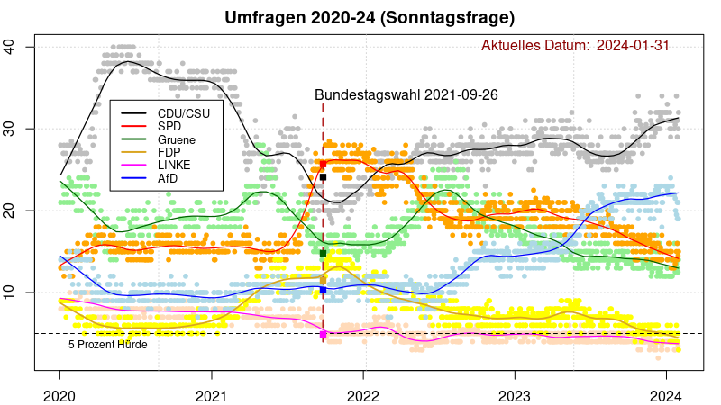
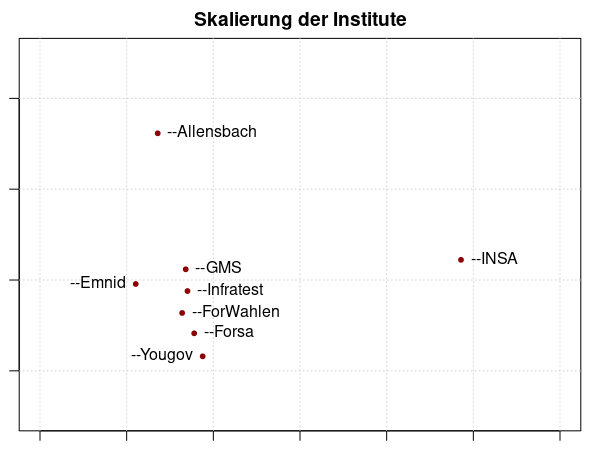

# Sonntagsfrage

Author: Hans W. Borchers, *Duale Hochschule BW, Mannheim*  
Date: *January 2024*

## Umfragen 2020-2024

### Einführung

In Deutschland finden mehrfach jede Woche Wahlumfragen zur Bundestagswahl statt. Die Frage an wahlberechtigte Bürger ist: "Wenn am nächsten Sonntag Bundestagswahl wäre, welche Partei würden Sie wählen?" Die wichtigsten beteiligten Umfrageinstitute sind wohl Allensbach, Verian (Emnid), Forsa, Forschungsgruppe Wahlen, GMS, Infratest Dimap, INSA und Yougov.

Die Daten aller dieser Institute werden auf der Plattform [Wahlrecht](https://www.wahlrecht.de/) veröffentlicht. Für die letzten aktuellen Umfragen siehe [Umfragen](https://www.wahlrecht.de/umfragen/). Die Art der Umfrage (Telefon, Online, ...) und die Anzahl der befragten Personen wird ebenfalls angegeben. Die Häufigkeit der Umfrage ist sehr unterschiedlich, zum Beispiel Allensbach nur einmal im Monat, INSA teilweise mehrfach pro Woche.

### Aktuelle Graphik

(*Diese Grafik wird hier zum Ende eines jeden Monats aktualisiert*)

### Erläuterungen

Jeder Punkt (kleiner Kreis) ist *ein* Umfrageergebnis für *eine* Partei; zu jeder Umfrage gehören also sechs Punkte zum gleichen Datum. Die durchgezogene Linie ist eine **Glättung** der Daten zu einer Partei, hier generiert mit Friedman's *SuperSmoother* (eine Glättung mit der *Lowess* Glättungsmethode würde eine fast identische Kurve erzeugen). Die Farben sind den Farben der jeweiligen Parteien angepasst.

Die gestrichelte, senkrechte Linie ist der Zeitpunkt der Bundestagswahl am 26.9.2021. Die darauf abgebildeten kleinen Quadrate markieren die offiziellen Endergebnisse der jeweiligen Parteien. Unten ist die "5-Prozent Hürde" eingezeichnet. Die letzten Umfragen vor dem Wahltag haben das Endergebnis der Bundestagswahl 2021 (im Mittel aller Umfragen) relativ gut vorausgesagt.

### Auswertung

Der *Median* der Umfragen aus den letzten vier Wochen ergibt eine gute Übereinstimmung mit dem letzten geglätteten Wert (dem Ende der geglätteten Linien in der Abbildung oben).

    CDUCSU    SPD Gruene    FDP  LINKE    AfD 
      31.0   14.0   13.2    4.5    4.0   21.2 

Die Ergebnisse der jeweils letzten Umfragen pro Institut sind in der folgenden Tabelle aufgelistet:

         Datum CDUCSU  SPD Gruene FDP LINKE  AfD   Institut
    2024-01-03   33.0 14.0   13.0   6   3.0 23.0        GMS
    2024-01-04   31.0 14.0   13.0   5   4.0 22.0  Infratest
    2024-01-11   29.0 15.0   12.0   6   5.0 24.0     Yougov
    2024-01-12   31.0 13.0   14.0   4   4.0 22.0  ForWahlen
    2024-01-25   34.0 15.0   13.5   6   4.0 19.5 Allensbach
    2024-01-27   29.0 16.0   16.0   4   4.0 19.0      Emnid
    2024-01-29   30.0 14.5   12.5   5   3.5 21.0       INSA
    2024-01-30   32.0 15.0   14.0   3   3.0 19.0      Forsa

### Diskussion

Die Anzahl der Umfragen pro Institut weist grosse Unterschiede zwischen den einzelnen Instituten auf: Allensbach zum Beispiel hat wahlberechtigte Bürger im Jahr 2023 nur einmal im Monat befragt, INSA dagegen zweimal (!) jede Woche.

    Allensbach  Emnid  Forsa  ForWahlen  GMS  Infratest  INSA  Yougov 
            12     50     50         18    8         24   104      12
      
Der Einfluss dieser Institute auf die Glättung der Kurve und auf den aktuellen Median der Umfragen ist damit sehr unterschiedlich.

Als Beispiel die gemittelte Voraussage aller Institute und der Vergleich, wenn jedes Mal eines der Institute weggelassen wird ('leave-one-out' Test), hier angewendet auf die Befragungen im Januar 2024.

    CDUCSU    SPD Gruene    FDP  LINKE    AfD 
      31.3   14.8   12.8    4.9    4.0   22.5  (alle Institute)
      31.3   14.8   12.8    4.9    4.0   22.5  (ohne Allensbach)
      31.4   14.8   12.8    5.0    3.9   22.5  (ohne Emnid)
      31.5   14.8   12.8    5.0    3.9   22.5  (ohne Forsa)
      31.4   14.9   12.8    5.0    3.9   22.5  (ohne Forschungsgruppe Wahlen)
      31.2   14.8   12.9    4.8    4.0   22.4  (ohne GMS)
      31.6   15.1   13.0    4.9    4.0   22.2  (ohne Infratest Dimap)
      31.3   14.5   14.0    4.9    3.6   21.7  (ohne INSA)
      31.6   14.8   13.0    4.8    3.8   22.3  (ohne Yougov)

Visualisiert man diese Tabelle über eine 'multidimensionale Skalierung' (MDS) Graphik, dann ergibt sich das folgend Bild, das die Abweichung von INSA, aber auch die der Allensbach-Umfragen deutlich zeigt.

'--INSA' bedeutet, dass hier alle Umfragen im Januar, ausser denen von INSA, einberechnet sind. Entsprechend für die anderen Punkte.
